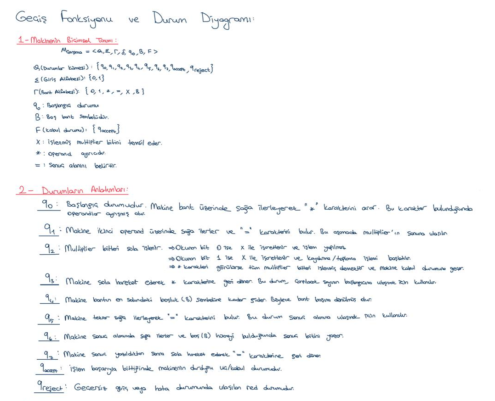
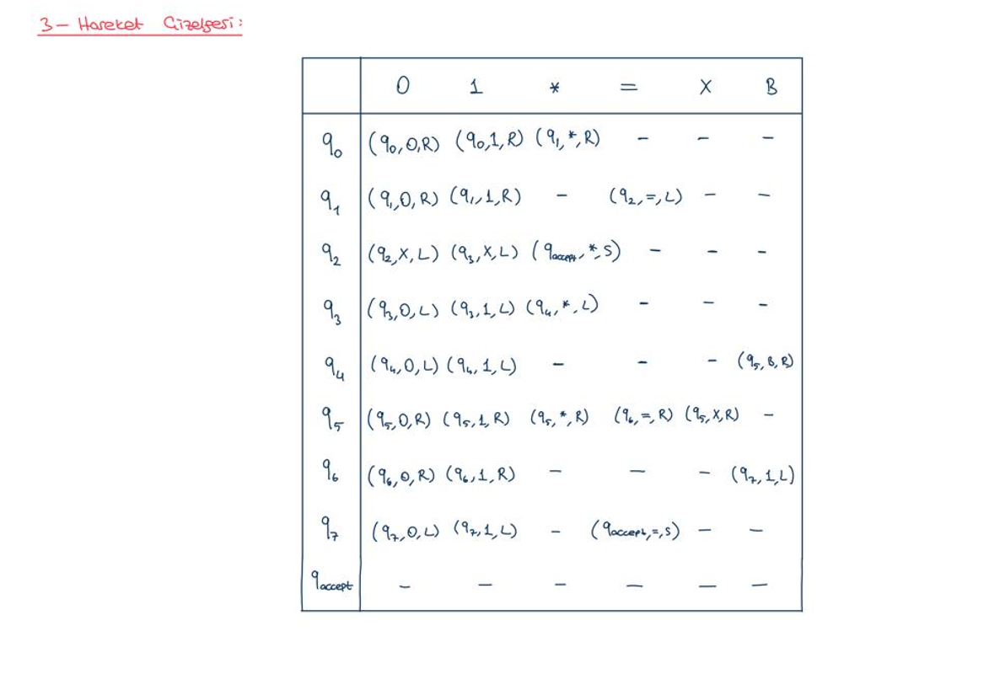
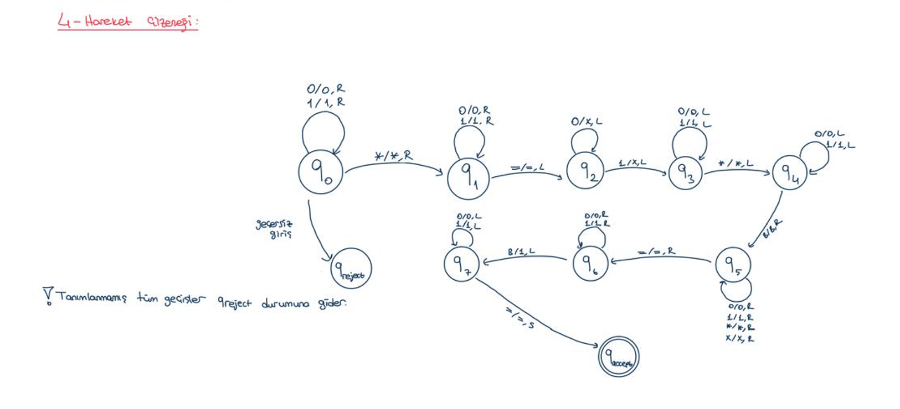
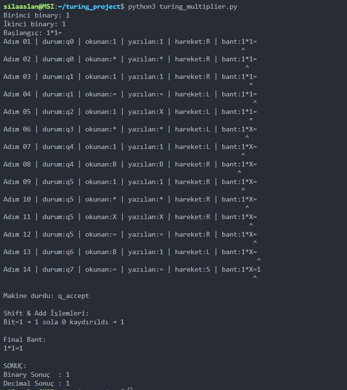
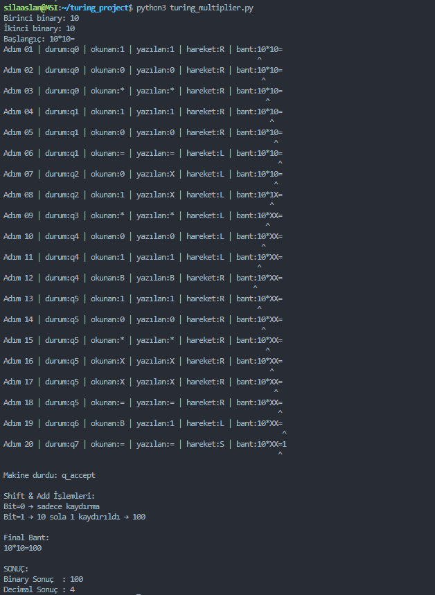
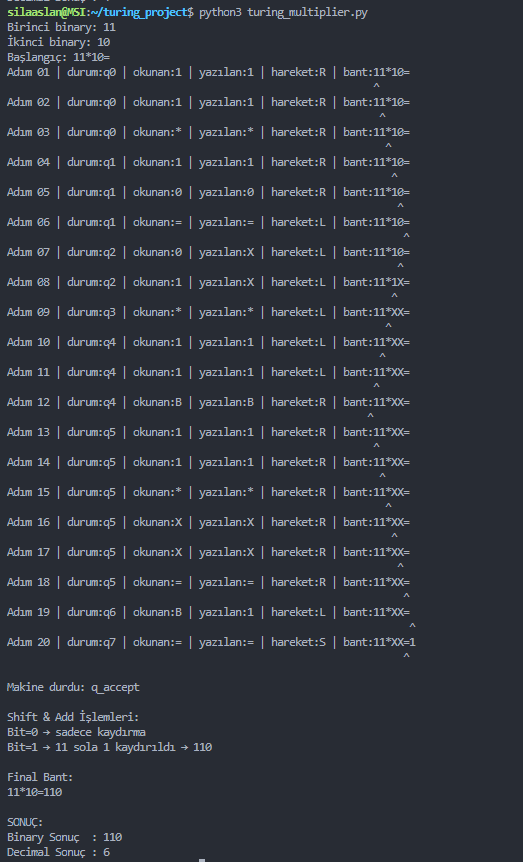
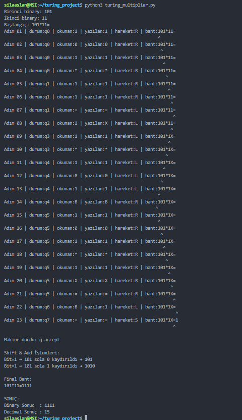
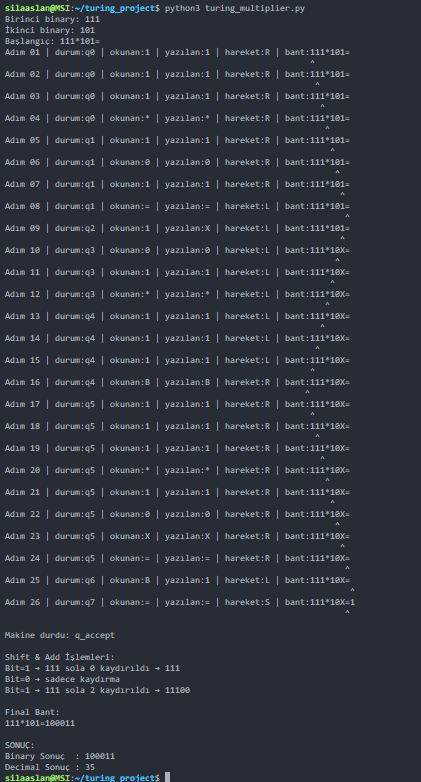

# Tek Bantlı Turing Makinesi ile Binary Çarpma Makinesi

## Proje Açıklaması 

Bu proje, Python kullanılarak geliştirilmiş bir Tek Bantlı Turing Makinesi simülasyonudur.

Makine, binary sayı sisteminde verilen iki sayıyı çarpar ve işlemi adım adım simüle eder.

---

## Proje Amacı

- Turing Makinesi mantığını anlamak
- Bant yapısı üzerinde işlem yapmak
- Operand ayrıştırma işlemini gerçekleştirmek
- Durum tabanlı işlem tasarlamak
- Binary çarpma işlemini modellemek
- Kullanılan Bant Formatı

---

## Kullanılan Bant Formatı

Program kullanıcıdan iki adet binary sayı alır.

Örnek giriş:

```text
Birinci sayı: 11
İkinci sayı: 10
```

Bant formatı:

```text
11*10=
```

Burada:
- `*`  → operand ayırıcı
- `=`  → sonuç başlangıç noktası

---

## Çalışma Mantığı

Makine aşağıdaki adımları uygular:

1. Bant üzerinde * karakterini bulur
2. Operandları ayırır
3. İkinci sayının bitlerini sağdan sola işler
4. Bit 1 ise sola kaydırma işlemi uygulanır
5. Bit 0 ise yalnızca kaydırma yapılır
6. Sonuç = karakterinden sonra yazılır

---

## Turing Makinesi Özellikleri:

Projede aşağıdaki Turing Makinesi bileşenleri bulunmaktadır:

- Tek bantlı yapı
- Okuma/Yazma kafası
- Durum kümesi
- Geçiş fonksiyonu
- Kabul durumu
- Red durumu
- Operand ayrıştırma mekanizması
- Adım adım simülasyon çıktısı

---

## Durumlar
| Durum | Açıklama |
|---|---|
| q0 | Bant üzerinde `*` karakterini arar |
| q1 | İkinci operand üzerinde ilerler |
| q2 | Multiplier bitlerini işler |
| q3 | Sola hareket eder |
| q4 | Bant başlangıcına döner |
| q5 | `=` karakterini bulur |
| q6 | Sonuç alanına yazma işlemi |
| q7 | Geri dönüş hareketi |
| q_accept | Kabul durumu |
| q_reject | Red durumu |

---

## Proje Dosya Yapısı

```text
turing_project/
│
├── turing_multiplier.py
├── README.md
│
├── images/
│   ├── gecis_tablosu.png
│   ├── durum_gecis_diyagrami.png
│   └── makinenin_bicimsel_tanimi.png
│
└── outputs/
    ├── ornek1.png
    ├── ornek2.png
    ├── ornek3.png
    ├── ornek4.png
    └── ornek5.png
```

---

## Makinenin Biçimsel Tanımı



---

## Geçiş Tablosu



---

## Durum Geçiş Diyagramı



---

## Örnek Çalışma

```text
11 * 10
```

### Shift & Add İşlemi

```text
11
× 10
------
00
+110
------
110
```

### Çıktı

```text
Binary Sonuç  : 110
Decimal Sonuç : 6
```

---

## Örnek Program Çıktıları

### Örnek 1



### Örnek 2



### Örnek 3



### Örnek 4



### Örnek 5



---

## Programı Çalıştırma

Terminal üzerinden:

```bash
python3 turing_multiplier.py
```

---
 
## Kullanılan Teknolojiler
- Python 3
- Turing Machine Simulation
- Binary Arithmetic
- State Transition System

---
