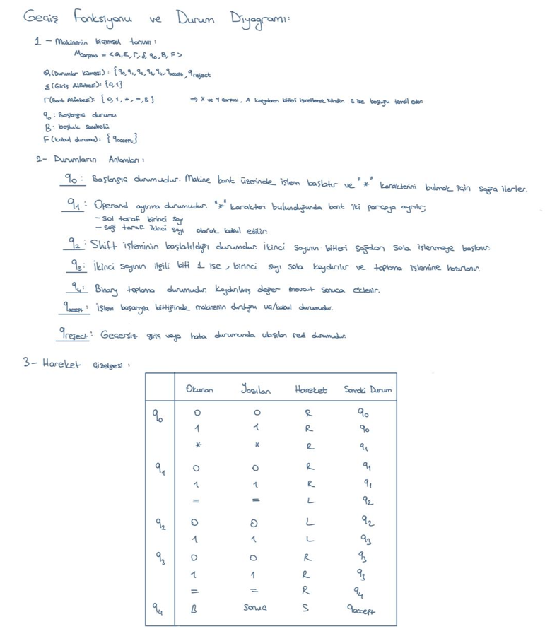
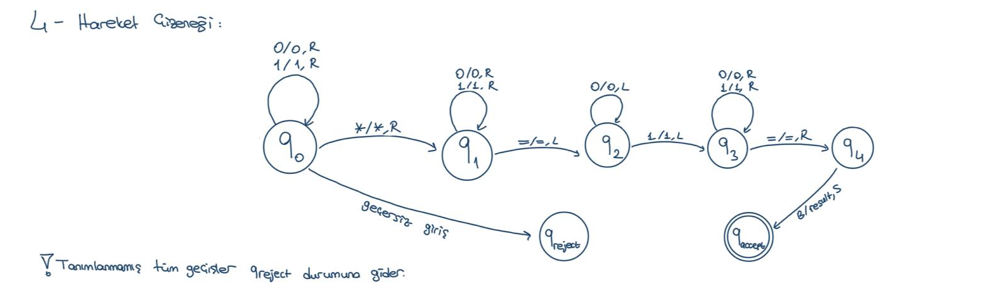
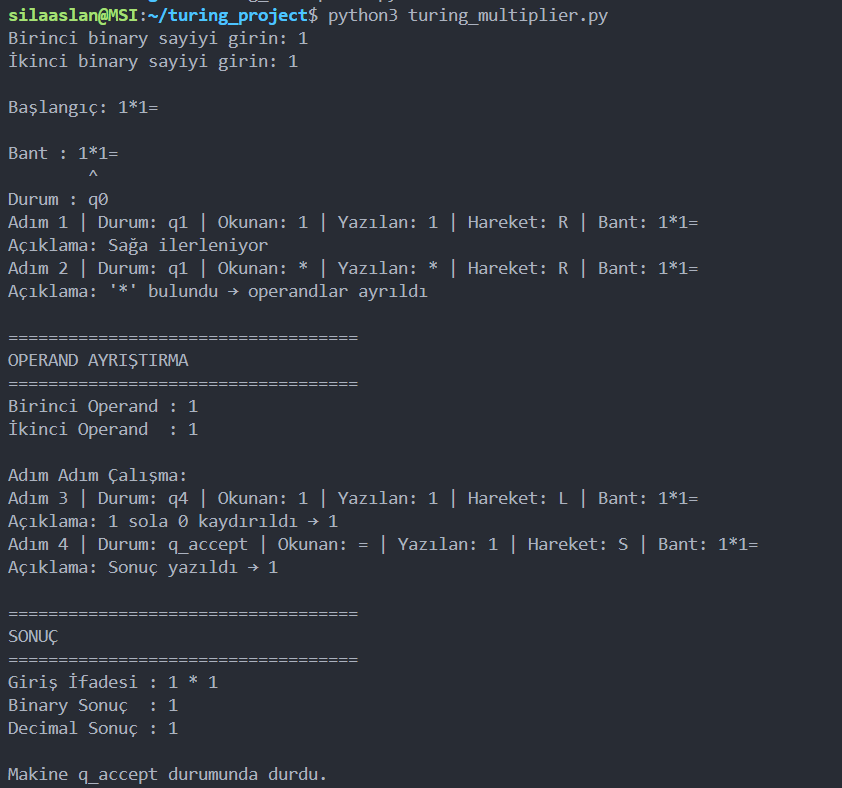
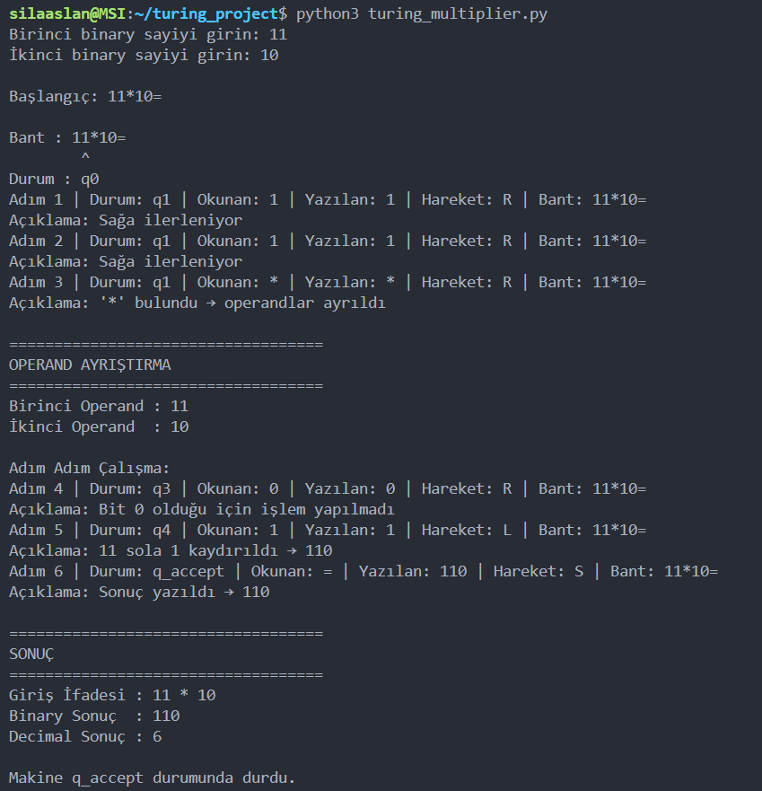
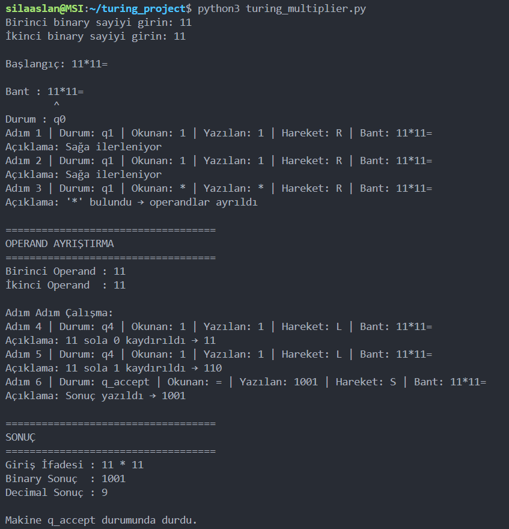
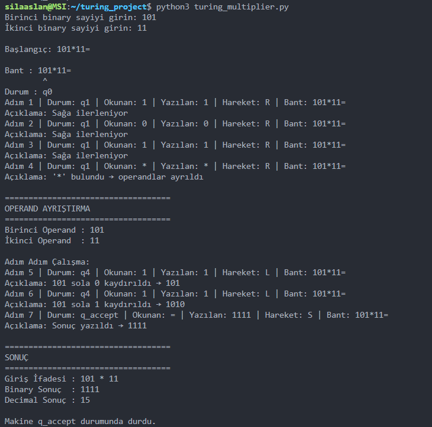
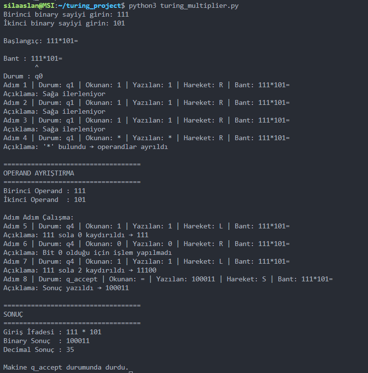

# turing-machine-binary-multiplier
Python-based Turing Machine simulator for binary multiplication with operand separation and step-by-step execution.
# Binary Çarpma Yapan Turing Makinesi Simülatörü

Bu proje, shift-and-add yöntemi kullanarak binary çarpma işlemi gerçekleştiren bir Turing Makinesi simülatörünü içermektedir.

## Özellikler

- Binary giriş doğrulama
- '*' karakteri ile operand ayrıştırma
- Turing bandı simülasyonu
- Durum geçişleri
- Adım adım işlem çıktısı
- Binary ve decimal sonuç gösterimi

## Biçimsel Tanım

M = (Q, Σ, Γ, δ, q0, B, F)

### Durum Kümesi

Q = {q0, q1, q2, q3, q4, q_accept, q_reject}

### Giriş Alfabesi

Σ = {0,1}

### Bant Alfabesi

Γ = {0,1,*,=,B}

## Operand Ayrıştırma

Makine operandları '*' ayıracı kullanarak ayırmaktadır.

Örnek bant:

101*11=

- Birinci operand: 101
- İkinci operand: 11

## Programın Çalıştırılması

```bash
python3 turing_multiplier.py

## Örnek Kullanım

Girdi:

```text
11
10
```

Çıktı:

```text
Binary Sonuç  : 110
Decimal Sonuç : 6
```

## Geçiş Tablosu



## Durum Diyagramı



## Örnek Çalışma Çıktıları

### Örnek 1



### Örnek 2



### Örnek 3



### Örnek 4



### Örnek 5


